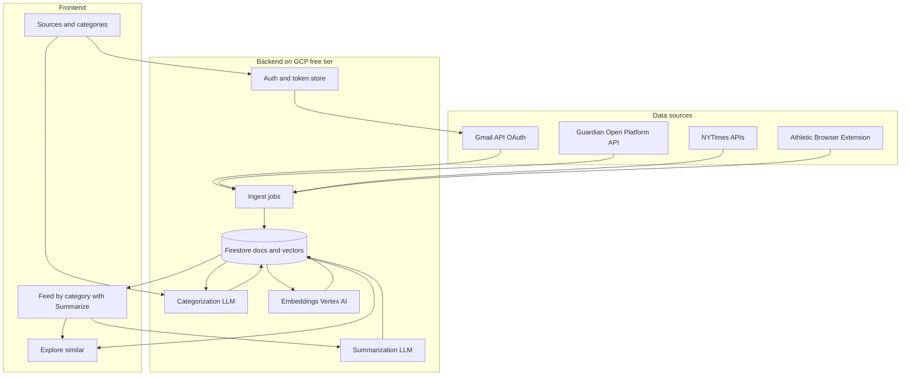

# Daily Reading Organizer App – Build Plan

## 1. What You Want vs What's Technically Available

| Source           | Your goal        | Reality                                                                                                                                                                                                                                                                                                                                                                                                                                               |
| ---------------- | ---------------- | ----------------------------------------------------------------------------------------------------------------------------------------------------------------------------------------------------------------------------------------------------------------------------------------------------------------------------------------------------------------------------------------------------------------------------------------------------- |
| **Gmail**        | Review my email  | **Fully supported.** Gmail API with OAuth2 (`gmail.readonly`). Read inbox, parse newsletters/digests, extract links and snippets.                                                                                                                                                                                                                                                                                                                     |
| **The Guardian** | Login + organize | **No login needed.** [Guardian Open Platform](https://open-platform.theguardian.com/documentation/) offers an API (free tier ~500 req/day). Search by tag/section, get article text and metadata. Use API key only.                                                                                                                                                                                                                                   |
| **NYTimes**      | Login + organize | **API ≠ account login.** [NYTimes Developer APIs](https://developer.nytimes.com/) (Article Search, Top Stories) give **metadata + abstracts + URLs** with an API key. Full article text is not in the API. Use API for discovery/categorization; for "Summarize" we have only abstract (or fetch full text where legally permissible).                                                                                                                  |
| **The Athletic** | Login + organize | **No public API.** We use a **browser extension**: when you're on an Athletic article you click "Save to Reading App" (and optionally "Summarize"); the extension sends URL, title, and **full article text** (from the DOM) to your backend. No automated login; you're already logged in in the browser. Categorization and summarization happen on your backend.                                                                                    |

So: **Gmail + Guardian + NYTimes** via APIs; **The Athletic** via a **browser extension** that captures URL, title, and full body from the page you're viewing.

---

## 2. Repository

All project code and documentation are stored in:

- **GitHub:** [https://github.com/dhookom/DailyOrg](https://github.com/dhookom/DailyOrg)

**Contents to store in the repo:**

- **Backend** – Cloud Run service (e.g. Node.js or Python), Dockerfile, and any Cloud Build / deploy config.
- **Frontend** – Next.js or React app (e.g. `frontend/` or `web/`).
- **Browser extension** – Athletic "Save to Reading App" extension (e.g. `extension/`).
- **Docs** – This plan (`docs/` or root), README with setup and run instructions, and any Firestore/vector-index notes.
- **Config** – Example env files (no secrets), Firestore index definitions or gcloud snippets.

Keep secrets (Gmail token, API keys) out of the repo; use GCP Secret Manager and document required env vars in the README.

---

## 3. Recommended High-Level Architecture

- **Backend:** Runs on **GCP free tier** (see Section 8): **Cloud Run** for the API and jobs; **Firestore** for all persistence and for **vector search** (Firestore’s native `find_nearest` on stored embeddings).
- **The Athletic:** **Browser extension** sends URL + title + full article body when you click "Save" (and optionally "Summarize") on an Athletic article.
- **Feed:** Headlines (and snippets) by category; each item has a **"Summarize"** button that fetches or uses stored full text and generates a summary (stored and displayed).
- **Explore:** **"Explore similar"** uses embeddings stored in Firestore and Firestore’s **vector similarity search** (`find_nearest`) to return other items similar to the current article.

---

## 4. New Features in Scope

### 4.1 Summarize (full-article summarization)

- **Feed:** Items appear as **headlines** (and optional snippet). Each row/card has a **"Summarize"** button.
- **On click:** Backend either (a) already has full text (Guardian API, or Athletic via extension), (b) fetches full text from Guardian API by item ID, or (c) for NYT has only abstract—show "Summarize abstract" or "Open to read" (no full-article summarization for NYT unless you add a permitted full-text source).
- **Flow:** Backend calls LLM with full article text (or abstract), stores summary in DB, returns it to the UI. UI shows the summary (expandable or in a modal).
- **Extension for Athletic:** When you click "Save & Summarize" in the extension, it can send URL + title + **full body** to the backend; backend categorizes, stores, and runs summarization in one go.

### 4.2 Explore similar content

- **UI:** From an article (or summary) there is an **"Explore"** (or "Find similar") action.
- **Backend:** Each item (or its summary) has an **embedding** (vector) stored. When you click "Explore," backend takes the current item’s embedding, queries the **vector store** for k nearest neighbors (excluding self), returns those items.
- **Vector store:** Use **Firestore vector search**: store embedding vectors in Firestore documents and use **`find_nearest`** (KNN) for "Explore similar." Create a vector index on the embedding field via gcloud/Firestore config. Embeddings generated with **Vertex AI text-embeddings** (or another provider); Firestore holds the vectors and runs similarity search. No separate vector DB.
- **When to embed:** Generate embeddings after categorization (and optionally after summarization) so "similar" is based on title + snippet + summary when available. Run embedding job on new/updated items (and backfill existing).

---

## 5. Tech Stack (Updated) – GCP free tier

- **Compute:** **Cloud Run** – backend API and scheduled/cron-triggered ingest (e.g. via Cloud Scheduler calling an HTTP endpoint). Free tier: 2M requests/month, 180k vCPU-seconds, 360k GiB-seconds; scale to zero when idle.
- **Database and vector store:** **Firestore** – single store for documents and vectors. Collections (or subcollections): users, tokens (encrypted), items (id, title, snippet, url, source, fullText, summary, category, fetchedAt, **embedding** vector). Use Firestore’s native **vector search** (`find_nearest`) on the embedding field (vector index created via gcloud/Firestore). Free tier: 50k reads/day, 20k writes/day, 1 GiB storage; `find_nearest` counts as reads.
- **Backend runtime:** Node.js (Express/Fastify) or Python (FastAPI). Handles OAuth, Guardian/NYT/Gmail APIs, extension webhook, LLM calls (categorization, summarization), and Vertex AI embeddings.
- **Embeddings:** **Vertex AI text-embeddings** (e.g. `text-embedding-004`) so everything stays on GCP; free tier/trial may apply. Alternatively another provider if you prefer.
- **LLM:** Vertex AI (Gemini) for categorization and summarization to keep usage on GCP free tier where applicable; or Anthropic/OpenAI if you prefer.
- **Secrets:** **Secret Manager** (GCP) – first 6 secret versions free; store Gmail refresh token, API keys, extension API key.
- **Frontend:** Next.js or React SPA; can be hosted on **Firebase Hosting** (free tier) or static assets on **Cloud Storage** + **Cloud CDN** within free limits.
- **Extension:** Minimal Chrome (or Firefox) extension: content script to read article title + body from DOM on the Athletic; popup or context menu "Save to Reading App" / "Save & Summarize"; POST to your Cloud Run URL with API key.

---

## 6. Data Flow (Concrete)

1. **Setup:** Connect Gmail (OAuth), add Guardian + NYTimes API keys, install browser extension, configure backend URL + API key in extension.
2. **Ingest:**
   - **Gmail:** List recent messages; extract subject, snippet, links; store as items.
   - **Guardian:** API → title, URL, body, section/tags; store (full text available for Summarize).
   - **NYTimes:** API → title, abstract, URL; store (abstract only for Summarize).
   - **Athletic:** Extension POSTs URL, title, full body; backend stores and optionally runs categorize + summarize immediately.
3. **Dedupe:** Normalize URL; skip duplicates (query Firestore by normalized URL).
4. **Categorize:** LLM assigns category (and optional confidence); write to Firestore.
5. **Embed:** For each item (title + snippet + summary if present), generate embedding via Vertex AI; store embedding on the same Firestore document (or linked doc); create/use vector index for `find_nearest`.
6. **Feed:** UI shows items by category; "Summarize" → backend returns or generates summary and writes to Firestore, then displays; "Explore similar" → Firestore `find_nearest` and return related items.

---

## 7. Security and Privacy

- **Credentials:** Gmail refresh token and API keys in **GCP Secret Manager** (first 6 secret versions free). Encrypt refresh token at rest if stored in Firestore.
- **Extension:** Authenticate with Cloud Run via API key (stored in Secret Manager); HTTPS only.
- **Data:** Content and summaries in Firestore on GCP; LLM/embedding provider (Vertex AI or third-party) sees text you send for categorization, summarization, and embeddings.

---

## 8. Hosting – GCP free tier only

- **Compute:** **Cloud Run** – 2M requests/month free, 180k vCPU-seconds, 360k GiB-seconds; scale to zero. Run backend as a container; use **Cloud Scheduler** (free tier: 3 jobs) to hit an ingest endpoint on a schedule (e.g. daily).
- **Database and vectors:** **Firestore** – 50k reads/day, 20k writes/day, 1 GiB storage free. Store items, users, tokens, summaries, and **embedding vectors** in Firestore; use native **vector search** (`find_nearest`) for "Explore similar." Create the vector index once (gcloud or Firestore console).
- **Secrets:** **Secret Manager** – first 6 secret versions free (Gmail token, Guardian/NYT keys, extension API key).
- **Frontend:** **Firebase Hosting** (free tier) or **Cloud Storage** + **Cloud CDN** for static Next.js/React build.
- **Embeddings/LLM:** **Vertex AI** for embeddings (and optionally Gemini for categorize/summarize) to keep traffic on GCP; check Vertex AI free tier/trial for your region.

Staying within these services keeps the app on GCP free tier; monitor Firestore read usage (each `find_nearest` counts as reads) so you stay under 50k/day.

---

## 9. Phasing (Updated)

- **Phase 1 – MVP:** Backend on **Cloud Run** + **Firestore** (no vector index yet); Gmail + Guardian (or NYT); LLM categorization; minimal feed UI with headlines; optional "Summarize" for Guardian (full text from API). Store items and summaries in Firestore.
- **Phase 2:** NYTimes + browser extension for Athletic (Save; send URL + title + body); "Summarize" for all sources that have full text (Guardian, Athletic via extension); store summaries in Firestore; ensure all on GCP free tier.
- **Phase 3:** Add **Vertex AI embeddings** and **Firestore vector index**; "Explore similar" in the UI using `find_nearest`; backfill embeddings for existing items; tune categories and prompts.

---

## 10. What to Decide Before Implementing

- **LLM/embedding provider:** Prefer **Vertex AI** (Gemini + text-embedding) to stay on GCP free tier; otherwise Anthropic/OpenAI for categorization and summarization, with Vertex AI only for embeddings if you want vectors on GCP.
- **Firestore vector index:** Create the index for the embedding field (dimension must match your embedding model, e.g. 768 or 1536) via gcloud or Firestore documentation before using `find_nearest`.

Once the index is defined, the next step is Phase 1: Cloud Run backend, Firestore, one news source, categorization, and feed with headlines plus "Summarize" where full text is available.
